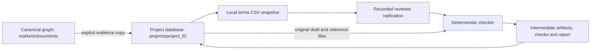

# Isolated project workflow graphs

The canonical graph remains in `markets/documents`. Each canonical project has exactly one deterministic database, `projects/project_<canonical-project-key>`, in the same SurrealDB instance. It contains copies of its evidence, entities, input files, derived files, decisions and run history. Projects can duplicate source material; there are no cross-database record links or shared mutable workflow records.

This implements the user's project-isolation requirement in preference to KG_handover's shared project-tagged design. It also preserves the user's instruction not to store facts: there is no `fact` or `term_fact` collection. Terms remain in source rows and immutable CSV snapshots. The PRD's full fact-register, messaging and learning-loop requirements are not implemented by this workflow layer.

## Data flow



`POST /projects/{id}/automate` performs materialization, optional local terms snapshot creation, input coverage checks and a checker run. `POST /projects/{id}/runs` executes only against already copied artifacts. The checker never queries the main graph, Gmail, Drive, Gemini or another project. It runs bundled trusted code in a temporary directory without connector or database secrets in its environment. This is synchronous orchestration with persisted run leases and resumable requests, not a background scheduler.

The materialization step copies explicitly selected source IDs and sources already attached to the project. It includes their MIME attachments, owning documents and structured source rows, plus the project/fund/management company and directly evidenced entity endpoints. It does not traverse arbitrary entity relationships to pull in other projects. Source selection is explicit because filenames and proximity are not reliable workflow scope.

Re-materializing adds new evidence versions to the same database. Existing copied records and artifacts remain immutable. Original canonical IDs are retained as provenance values; the copied records are physically independent. New main-graph changes have no effect on an existing run until explicitly materialized and selected as new inputs.

## Records inside each project

| Table | Purpose |
|---|---|
| `manifest` | Frozen project identity, originating main-graph revision, creation time and review-turn counter |
| `node` | Copied canonical entities and sources, materializations, artifacts, ratifications, runs and check results |
| `link` | Native SurrealDB graph edges: copied, derived_from, evidence_for, uses, produced, checks, cites, ratifies; copied original relationships |
| `artifact` | Filename, role, SHA-256, size and source/derivation IDs |
| `blob` | Artifact bytes, base64 encoded and stored inside this project's database |
| `decision` | Immutable artifact-version ratification, reviewer, evidence and reason |
| `run` | Input artifact IDs, gate/runtime fingerprint, status, lease, review turn and output artifact IDs |

Retained artifacts include original XLSX/CSV/PDF/EML files when available; extracted text; parsed elements/chunks; local terms snapshots; input manifests; exact checker code; checker output/log; deterministic checks JSON; and the standalone Markdown report. Check-result nodes cite local input artifact IDs; inherited clauses/row identifiers are included in checker details. The adapters do not provide full page/line citations for every loader finding yet.

Connector graph ingestion now retains original bytes in the canonical `source_blob` table. Previously ingested files may have only extracted text. Materialization returns `missing_originals` for those sources and preserves the text as a labeled derivative. It never reconstructs a workbook and calls it the original. Re-ingest the connector source to retain its original bytes; the existing source identity remains idempotent. Scheduled connector workers now post original bytes and stable provider/account/source envelopes to `/sources`. Versioned completion markers replay earlier document-only ingestions once. Large workbooks retain their originals and a bounded structural manifest, deferring full parsing to project processing. The separate `/documents` upload API is unchanged.

## Workflow behavior

Two gates are bundled from the supplied demo folders:

- **Terms / side letters:** fee and commitment schedule checks; terms mode or arithmetic-only mode. Resolve entity and quarter from the workbook Cover and validate against the project's fund and quarter. Terms snapshots and entity terms require recorded ratification before terms checking. An amendment produces another immutable snapshot and requires its own ratification. Arithmetic-only results cannot declare a draft ready for release.
- **Loader gate:** run the supplied loader evaluator with explicit source GL, candidate loader and mapping workbook inputs. The adapter removes the original author's hard-coded filesystem paths and quarter. Candidate rows must belong to the project's legal entity and quarter. Missing source/mapping workbooks produce a persisted `blocked` run. The original workbooks were located in `Ylookup Hackathon Datasets.zip`. Exact Corvus IDs and LE Mapping select project rows into deterministic intermediate workbooks, preserving original row numbers. Fund 2254 Q2 reference validation completed with 49 PASS and one WARN.

The gate code is vendored under `app/gates/`. Modifications remove timestamped run/triple output; the workflow owns provenance and artifact storage. The terms checker uses absolute comparison tolerances (`rtol=0`) to prevent value-sized relative tolerances from hiding monetary errors. No model runs on the evaluation path. The standard gate inputs are fixed artifacts; term values are not extracted from prose during a check.

Results use the existing PASS/FAIL/WARN/DECISION/SKIPPED states. `completed` means the evaluation finished, not that the draft passed or the fund administration project is completed. Failed checks are successful executions with findings. Missing inputs, missing ratification or wrong scope yield `blocked`; execution failures yield `failed`. The canonical project status is never changed by a checker.

Run IDs include project, input IDs, gate code and package versions, mode and ratifications. Exact replay returns the existing completed run and does not increment the review turn. Corrected drafts produce new runs, preserving all older inputs/results. Concurrent claims use a transaction and a 20-minute lease; execution has a 10-minute subprocess timeout. A lost caller can retry after lease expiry. Failed/blocked runs can be retried; checking uses a fresh claim token so an expired worker cannot finish a newer worker's run. Immutable checkpoints may remain after partial failure and are reused safely.

`checks.json` is the deterministic findings artifact. Audit times and review-turn metadata live separately in the run record. Reports list input fingerprints and include passes and decisions as well as failures. Amounts across overlapping checks are not summed into a misleading total.

## API sequence

All routes use the existing Cloud Run IAM boundary. They accept canonical project IDs, not arbitrary database names, SQL, filesystem paths or executable code.

1. Materialize: `POST /projects/{id}/materialize` with `{"source_ids":["SOURCE_KEY", "..."]}`. This returns source-to-artifact mappings and missing-original diagnostics. You can call it again with new evidence without replacing history.
2. Produce local terms: `POST /projects/{id}/terms-snapshot` with `{"as_of":"2026-06-30"}`. This reads only the copied source rows and returns a CSV artifact ID.
3. Ratify the terms and entity-terms artifacts independently: `POST /projects/{id}/ratifications` with `{"artifact_id":"ARTIFACT_KEY","actor":"reviewer@example.com","evidence_ids":["LOCAL_SOURCE_KEY"],"reason":"Reviewed against the cited clauses"}`. In multi-user mode actor attribution is taken from the authenticated frontend session, overriding this request field. Legacy local mode uses the supplied operator attribution.
4. Run: `POST /projects/{id}/runs` with:

```json
{
  "gate":"terms",
  "mode":"terms",
  "inputs": {
    "draft":"LOCAL_ORIGINAL_XLSX_ARTIFACT",
    "terms":"LOCAL_TERMS_SNAPSHOT_ARTIFACT",
    "entity_terms":"LOCAL_ENTITY_TERMS_CSV_ARTIFACT"
  },
  "ratifications": {
    "terms":"TERMS_DECISION_KEY",
    "entity_terms":"ENTITY_TERMS_DECISION_KEY"
  }
}
```

For arithmetic-only use `gate=terms`, `mode=arithmetic-only` and only `draft`. For loader checking use `gate=loader`, `mode=loader`, and `draft`, `source_gl`, `mappings`, optionally `reference`. The loader candidate sheet is `Upload Template` or the unambiguous `Upload Template (VERIFIED v4c)`; mapping sheet names follow the supplied evaluator.

The combined `POST /projects/{id}/automate` route takes `gate`, `mode`, `source_inputs` (role → main-graph source ID), optional `evidence_source_ids` and optional `ratifications`. For terms mode it generates a local snapshot if no terms artifact was selected. The first run can legitimately return `blocked` pending ratification, with local input IDs available for review. It does not auto-ratify legal terms or dispatch messages.

Read APIs:

- `GET /projects/{id}` — project manifest.
- `GET /projects/{id}/graph?table=node` or `table=link` — paginated local graph.
- `GET /projects/{id}/artifacts` — artifact inventory.
- `GET /projects/{id}/artifacts/{artifact_id}` — original or intermediate file download.
- `GET /projects/{id}/runs` — paginated review history.

## Database credentials and deployment

Provisioning uses the namespace-scoped `workflow_provisioner` identity in `projects`; it has no permissions in the canonical `markets` namespace. Each project has a different database-scoped `workflow` identity/password. The password is derived with HMAC from the project ID and `SURREAL_PROJECT_SECRET`. Runtime project queries never use provisioning credentials. Keep the derivation key stable; rotation requires explicitly rotating existing project database users as well.

Required service configuration:

- Existing `SURREAL_URL`, `SURREAL_USER`, `SURREAL_PASSWORD` for canonical ingestion.
- `SURREAL_PROJECT_ADMIN_USER=workflow_provisioner`.
- `SURREAL_PROJECT_ADMIN_PASSWORD`: namespace provisioning credential.
- `SURREAL_PROJECT_SECRET`: project credential derivation key.

Terraform adds the two secrets and their narrowly assigned access, initializes the project namespace/user in the VM startup template, and passes the secrets to Cloud Run. The secret resources and Cloud Run environment configuration were applied on 2026-09-05 with zero resources destroyed. Startup-script changes are ignored for existing VMs to prevent replacement. The production namespace bootstrap and release-image upload were blocked by automatic approval review and require explicit approval; no new workflow image has been deployed. Bootstrap must use the narrow migration, never rerun the full VM startup script. No project or workflow data is deployed by tests.

Local Compose includes development-only values. After rebuilding/recreating the local service, run:

```sh
docker compose exec ingestion python -m app.project_store
```

This explicitly bootstraps the local namespace/provisioner using the local root database identity. Production uses the VM startup template instead.

Database-level segregation is verified with real project-scoped credentials: reads outside their database return no records, and cross-database writes make no changes. The instance owner retains administrative access. The HTTP API remains a trusted operator API with service-level IAM; external multi-client access still needs per-user/client authorization before selecting a project route.

## Verification and limits

The integration tests create disposable databases and remove them afterwards. They check the full supplied Q2/Q3 terms workflow, expected failures, corrected draft, immutable history, missing inputs/ratification, wrong-period rejection, source copying, and operation with the parent graph unavailable. They do not use Gemini or live connectors.

```sh
PYTHONPATH=services/ingestion python -m unittest discover -s services/ingestion/tests -v
# In a local environment with root SurrealDB credentials and the demo folder:
KG_PROJECT_TESTS=1 PROJECT_TERMS_FIXTURES=/path/to/05-terms-and-side-letter-demo \
  PYTHONPATH=services/ingestion python -m unittest discover -s services/ingestion/tests -p test_projects.py -v
```

The loader evaluator has been validated against the supplied original workbooks. Its inherited pandas implementation materializes tables in memory; this is not yet the PRD's streaming large-deliverable implementation. This layer does not implement automatic inbox triggers, outbound decision requests, automatic financial corrections, learning cases/expiring exceptions, or a full legal-clause ratification UI. Those are separate PRD phases; workflow data and execution history now have an isolated home.
